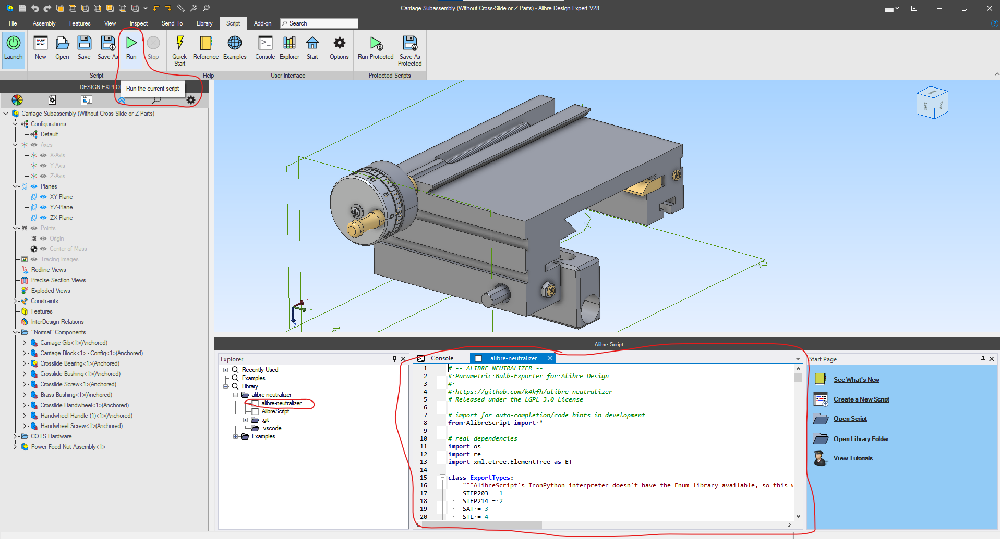
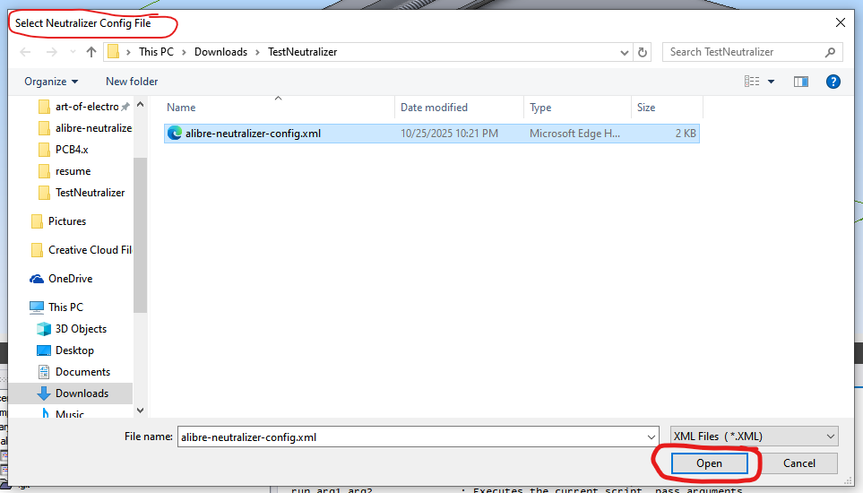
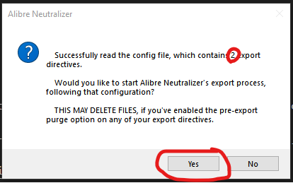
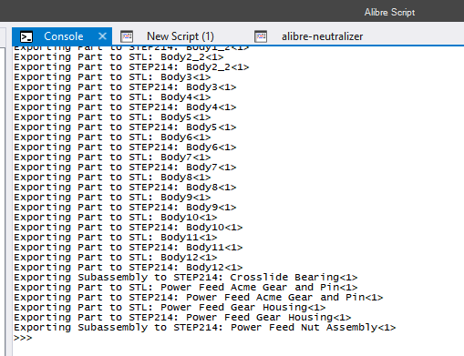
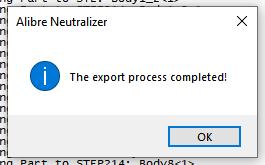

# Alibre Neutralizer: Parametric Bulk-Exporter for Alibre Design

> This is a 3rd-party script, not an official Alibre product.

Alibre Neutralizer is a configurable, repeatable bulk-exporting tool for [Alibre Design Mechanical CAD files.](https://www.alibre.com/) It's specifically geared for multidisciplinary projects (e.g. PCB + Case + Firmware) that utilize Git repositories as a single source of truth for design data.

To use it, you can define an XML configuration file that describes the file types you'd like to export, and how you'd like them organized (they can be grouped/named using Part Numbers, Supplier metadata, and any other Alibre Properties). Store this configuration file in your project's Git repository - then you can export comprehensive, consistently-organized neutral MCAD files in seconds. Simply open Alibre Neutralizer from within the Alibre Script add-on, select your configuration file, and the export process will begin.

## What problem does this solve?

I use Alibre for open-source hardware designs, because for me personally, FreeCAD is not quite "there" yet. I can work much more quickly, and document my designs more clearly, using Alibre. However, even with Alibre's new PDM functionality, I still want to store and version my Alibre designs in an open-source-friendly manner.

For most electromechanical devices, the GitHub "monorepo" approach is my default - I like to store _everything_ (software, MCAD files, ECAD files, and documentation) in a single repository, so each Release from that repository is a complete snapshot of the product.

The best way to store an Alibre mechanical design in a Git repository is to use Alibre's Package feature. This generates a single ``.AD_PKG`` file, which contains all constituent models and is completely portable. However, this has one notable flaw: potential contributors _without_ Alibre licenses cannot even view the models, much less modify them. The hardware is only _really_ open-source once you've paid for an Alibre license. This is, of course, not ideal.

The best solution to this problem is to export neutral files, in addition to the "Native" Alibre Design files. There are two good candidates for this:
* **STEP Files:** This is a "universal" neutral file. Practically every CAD software will accept this file type, but it does require translation, so it is occasionally subject to data loss/errors.
* **SAT Files:** This is the "native tongue" of the ACIS modeling kernel, which is the kernel Alibre uses under the hood. In theory, these files should be the _least_ error-prone, while still remaining "neutral" (unlike proprietary Alibre files).

In most cases, files should be exported at 3 levels:
* **Top-Level Assembly:** This would be the complete device (e.g. ``MyEntireWidget.stp``).
* **Subassemblies:** Any subassemblies should be exported individually, in case subassembly-level models are needed for procurement or manufacturing.
* **Parts:** Parts should be exported individually, to support manufacturing and procurement. For instance, although ``MyEntireWidget.stp`` contains all the necessary subcomponents, it is a hassle to "separate" the components in a STEP file. By exporting neutral files for each part, ``MyPlasticPart.stp`` can be 3D-printed exactly as-is, with no need to open up modeling software and "isolate" it manually.

## Features

### Current Features

* [x] Recursively export a complete assembly, with all its constituent subassemblies and parts exported separately
* [x] Export all common neutral file types: STEP, SAT, IGES, STL
* [x] Organize exports parametrically - Alibre Properties like Part Number, Revision, etc can be used in filenames and folders. This unlocks _many_ use cases, like:
  * Grouping exports into folders based on Alibre's "Supplier" property (or any other Alibre Property)
  * Naming files in ``PartNumber_PartDescription_Revision`` format
* [x] Automatically clear "old" files from the export directory before a fresh export
* [x] All export settings are stored in a configuration file, so the export is repeatable and the resulting file structure is consistent
* [x] Export to multiple file types, under multiple different parametric folder/name schemes, in a single export operation

### Future Feature Goals

Contributions are welcome!

* [ ] **Defining the Alibre Version used in the native files.** This could be important if collaborators are running slightly older versions of Alibre.
* [ ] **Granular error logging at a configurable path.** It would be great if, on any errors, a log file was created in the Git repo where your files were being exported. This file could even be caught by a CI/CD system, to prevent releasing bad/incomplete data.
* [ ] **Including and excluding certain components from the export process.** For example, if a particular subassembly is only purchaseable as a complete unit (not as separate subcomponents), then there is likely no reason to export its subcomponents to their own neutral files. The current software allows exclusions based on component type, but nothing more granular than that. It would be nice to be able to exclude based on Alibre Properties.
* [ ] **Support for "Purging" Alibre Properties.** In many business contexts, you may be comfortable sharing design data, but _uncomfortable_ sharing the supplier/pricing metadata embedded in the CAD files. It would be nice if the config file allowed you to define how that data should be systematically purged, although this would probably require generating a fresh "copy" of all the native Alibre files, to avoid data loss in the "master" files.
* [ ] **Export Alibre Properties and Design Parameters to a CSV "sidecar" file.** It would be nice to add another export "file type" that produces a CSV file containing all the properties and Design Parameters in each file. That would make even more information visible to folks who don't have Alibre licenses (and ease integration with business systems like ERP and e-commerce).
* [ ] **Defining required "manual exports", such as BOMs/PDFs/DXFs, on a per-component basis.** Alibre Script cannot currently do anything with BOM files or drawing files, so a fully-automated "Export BOM to CSV" and "Export Drawing to PDF/DXF" is off the table. In fact, Alibre Script has no way to find out if a part/assembly even has an accompanying BOM or drawing - the only system that would have this information is the new Alibre PDM, which has no public-facing API at this point. With these limitations in mind, I think the best compromise would be to include "flags" in the configuration file that indicate which components "require" a BOM or a drawing (and perhaps which file types should be exported for those items). Then this export tool could remind the user to manually export these items, and a good CI/CD pipeline could ensure that when MCAD files are modified, these items get modified as well.

## Installation

_You must have Alibre Design with the Alibre Script add-on installed on your system to use this tool._

To install the script, download or clone the repository into a subfolder within your Alibre Script Library. By default, this is in your Documents folder - something like ``C:\Users\John Doe\Documents\Alibre Script Library``.

_Technically_ you only need ``alibre-neutralizer.py``, but I recommend copying the entire repository. That way you'll have an example configuration file and this README to fall back on.

## Configuring

Alibre Neutralizer works on a concept called _"Export Directives."_ An _Export Directive_ includes the following settings:
* **File Type** : ``STEP203``, ``STEP214``, ``SAT``, ``STL``, ``IGES``, ``CSV_Properties`` (dump all the Alibre Properties like Cost Center, Stock Size, etc to CSV), or ``CSV_Parameters`` (dump all the Alibre Parameters, like you see in the Equation Editor, to a CSV file)
* **Relative Export Path** : This defines the file name and folder structure of the files exported under this directive. You can use any Property from Alibre here - Part Number, Cost Center, Supplier, you name it. Reference properties in Python string format, using the variable names from Alibre's API. For example, to reference the Part Number, use ``{Number}``. To reference the component's name, use ``{Name}``. This path is defined _relative to_ the location of your config file, with an optional "global offset" that can be specified at the top of the config file. So if you put your config file in ``./myGitRepo/MCAD/``, you might set your export path to ``./STEPs/{Number}_{Name}.stp``.
* **Purge Directory Before Exporting?** : This controls whether Alibre Neutralizer deletes existing files before exporting. If you turn it on, it will only remove files of the type specified in this export directive (so it won't stop you from including a README or something in your STEP file folder).
* **Enable Root Assembly Export?** : This controls whether the root assembly is exported under this Export Directive. Set it to ``false`` to skip exporting the root.
* **Enable Subassembly Export?** : This controls whether subassemblies (at any level of recursion) are exported under this export directive. Set it to ``false`` to skip them (only export the root assembly and then recursively export all parts).
* **Enable Part Export?** : This controls whether parts are exported under this export directive.

You can configure as many _Export Directives_ as you like, and you can run them all at once with a single click. Remember, you need one Export Directive _per file type that you want to export_.

### Example Use Case

Let's say you've designed a product with some 3D-printed parts, sheet metal parts, and off-the-shelf components. It's best for the 3D-printed parts to be exported to STL, to go straight into a slicer. It's best for the sheet metal parts to be exported to STEP. You'd also like the main assembly and any subassemblies exported to STEP. How would you do this?

You'd need at least 2 _Export Directives_:
1. Export Directive 1 : Export _only parts_ to STL, for 3D-printing.
2. Export Directive 2 : Export _everything_ to STEP.

Let's also say you'd like the STEPs grouped into folders based on their "Supplier" property in Alibre.

Here's an example of how that configuration file would look:

```xml
<?xml version="1.0" encoding="UTF-8"?>
<AlibreNeutralizerConfig>
    <!--The "Base" export path, relative to this config file's directory.
    This is essentially an "offset" for all the RelativeExportPath tags below.-->
    <BaseExportPath>./Alibre-Neutralizer-Exports/</BaseExportPath>
    <ExportDirectiveList>
        
        <!-- Export only Parts to STL, for 3D-printing -->
        <ExportDirective>
            <type>STL</type>
            <RelativeExportPath>./STLs/{Number}_{Name}.stl</RelativeExportPath>
            <PurgeDirectoryBeforeExporting>./STLs</PurgeDirectoryBeforeExporting>
            <EnableRootAssemblyExport>false</EnableRootAssemblyExport>
            <EnableSubassemblyExport>false</EnableSubassemblyExport>
            <EnablePartExport>true</EnablePartExport>
        </ExportDirective>

        <ExportDirective>
            <type>STEP214</type>
            <RelativeExportPath>./STEPs/{Supplier}/{Number}_{Name}.stp</RelativeExportPath>
            <PurgeDirectoryBeforeExporting>./STEPs</PurgeDirectoryBeforeExporting>
            <EnableRootAssemblyExport>true</EnableRootAssemblyExport>
            <EnableSubassemblyExport>true</EnableSubassemblyExport>
            <EnablePartExport>true</EnablePartExport>
        </ExportDirective>

    </ExportDirectiveList>
</AlibreNeutralizerConfig>
```

## Running an Export

**Warning: Alibre Neutralizer is not guaranteed to work with Alibre PDM!** If you want to use Alibre Neutralizer with Alibre PDM, I recommend you export a Package (``.AD_PKG``) from Alibre PDM, then open that package on your local filesystem to perform the exports. I have gotten extremely strange and unpredictable results trying to export directly from Alibre PDM.

After creating a configuration file and saving it in an appropriate place on your filesystem, you're ready to run an export.

Open the Alibre Script add-on, open ``alibre-neutralizer.py`` within it, and click "Run" in the Alibre Script ribbon.



When prompted, select your configuration file.



If Alibre Neutralizer is able to understand your configuration file, it will show this dialog. Note the number of export directives it processed - if this doesn't match your configuration file, something is wrong. Assuming it understood your configuration as-expected, click "Yes" to start the export process.



While exporting, Alibre Neutralizer logs to the Alibre Script console. Although a better error handling system is on the wishlist, keep an eye out for any "Error" messages in the console, as this is currently the only place that they're logged.



When the export is complete, Alibre Neutralizer will notify you like this:



## Typical Use Case

See [the ``example-project`` directory](./example-project/) for a sample of how Alibre Neutralizer could be set up in an open-hardware focused repository.
